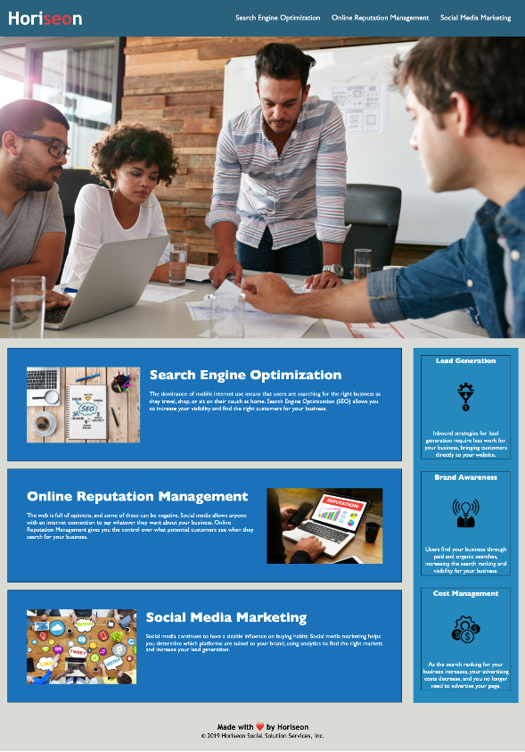

# Horiseon Refactor

## Description
To refactor both the HTML and CSS on the given UI landing page designed for desktop viewing. The HTML will now contain semantic HTML labeling, grouping of similar coding will be creating through class designation for CSS styling, and initial links will work that connect the navigation bar to the content sections.

## User Story

```
AS A marketing agency
I WANT a codebase that follows accessibility standards
SO THAT our own site is optimized for search engines
```

### Acceptance Criteria

```
GIVEN a webpage meets accessibility standards
WHEN I view the source code
THEN I find semantic HTML elements
WHEN I view the structure of the HTML elements
THEN I find that the elements follow a logical structure independent of styling and positioning
WHEN I view the icon and image elements
THEN I find accessible alt attributes
WHEN I view the heading attributes
THEN they fall in sequential order
WHEN I view the title element
THEN I find a concise, descriptive title
```

### Mock-up
This image provides an example of the design.


### Deployment
(https://amccorkl.github.io/Horiseon/)
